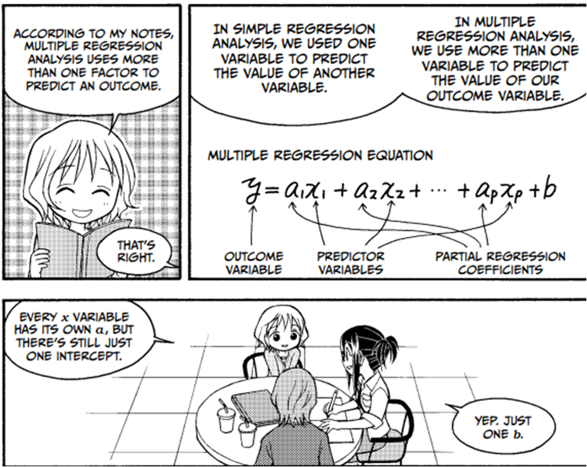
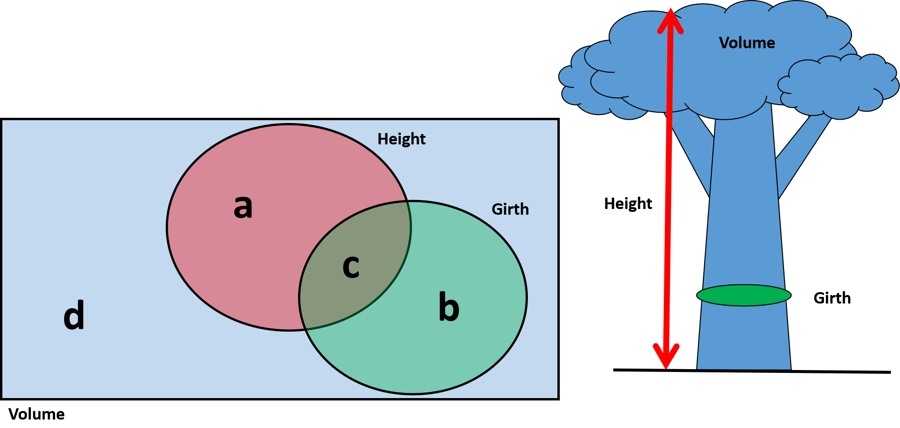

```{r setup, include=FALSE}
knitr::opts_chunk$set(echo = TRUE)
if(!require(GLMsData)){install.packages("GLMsData")}
if(!require(scatterplot3d)){install.packages("scatterplot3d")}
if(!require(tidyverse)){install.packages("tidyverse")}
if(!require(VennDiagram)){install.packages("VennDiagram")}
if(!require(datasets)){install.packages("datasets")}
if(!require(car)){install.packages("car")}
if(!require(kableExtra)){install.packages("kableExtra")}
```

## 1. Pressupostos Modelo Linear

**L**inearidade

**I**ndependência

**N**ormalidade dos resíduos

**H**omocedasticidade dos resíduos

**A**usência de *outliers*

### A. Linearidade

Criando um modelo artificial e que não é linear (no caso, é quadrático)

```{r}
set.seed(1)
x <- rnorm(n=50, mean=30, sd=10)
y <- 10 +2*x +0.1*x^2 +(rnorm(n=50, mean=0, sd=10))
```

Plotando a relação entre `y ~ x` e vendo seu ajuste (´R-squared´) e coeficientes (`Estimate` e `Pr(>|t|`)

```{r}
plot(y~x)
abline(lm(y~x), col="red")
```

```{r}
summary(lm(y~x))
```

No caso, o modelo proposto tem excelente ajuste e os coefiecientes são significativos (são diferentes de zero). Podemos interpretar o modelo linear como:

$$y = -59.89 + 7.61*x$$

Vendo se os resíduos seguem distribuição normal:

```{r}
modelo <- lm(y~x)
residuos <- residuals(modelo)
shapiro.test(residuos)
```

p-valor > 0.05, logo, podemos assumir que os resíduos seguem distribuição normal.

Porém, é importante verificar outros padrões de um modelo linear:

```{r}
par(mfrow=c(2,2))
plot(modelo)
```

O primeiro gráfico a esquerda mostra um padrão não ideal, onde não apresenta os resíduos com valores constantes em relação a $\hat{y}$ (`Fitted values`). Ou seja: **não é linear**!

Para verificar a não linearidade, importante ver os seguintes pontos:
  * 1. As variáveis tendem a apresentar relação linear ou não? Por exemplo: relação entre volume (que é cúbico) com área (que é quadrada);
  * 2. Veja o padrão da reta. Funcionalidade `car::crPlots(x)`, onde `x` é o modelo a ser testado.
  * 3. Verifique individualmente cada variável. Talvez alguma transformação dos dados seja necessária (ver [box-cox](https://www.statisticshowto.com/box-cox-transformation/)).

Função `car::crPlots()`:

```{r}
car::crPlots(modelo)
```

a linha tracejada é o modelo linear e a linha contínua aponta uma relação não linear (quadrática, no caso). Portanto, construir modelo quadrático:

```{r}
modelo2<-lm(y ~ x + I(x^2))
```

Dessa maneira calcula três coeficientes:
$$y = \beta_0 + \beta_1x +\beta_2x^2$$
Veja o `summary()`:

```{r}
summary(modelo2)
```

Equivale a:

Dessa maneira calcula três coeficientes:
$$y = 10.69 + 2.10*\beta_1*x +0.09*x^2$$
Muito próximo ao modelo criado:`y <- 10 +2*x +0.1*x^2` com resíduos (erros) $\sim N(0,10)$ (`rnorm(n=50, mean=0, sd=10)`)

Explorando os gráficos dos resíduos:

```{r}
par(mfrow=c(2,2))
plot(modelo2)
```

Os resíduos já tem um comportamento linear e ainda com distribuição normal:

```{r}
shapiro.test(residuals(modelo2))
```

Para verificar qual modelo é melhor, podemos utilizar o [critério de Informação de Akaike](https://en.wikipedia.org/wiki/Akaike_information_criterion):

```{r}
AIC(modelo, modelo2)
```

Como, $AIC = 2k - 2ln(\hat{L})$, onde $k$ é o número de parâmetros, $\hat{L}$ é o valor máximo da função de verossimilhança (*likelihood*) para o modelo.

Onde o modelo quadrático (`modelo2`), apesar de ter mais coeficientes (parâmetros) a serem calculados, apresentou valor de AIC menor (`AIC = 375.866`) do que o modelo simples (`AIC = 406.846`), com diferença maior do que de 2 ($\Delta AIC \ge 2$).

    Na próxima apostila veremos sobre Multicolinearidade, que é importante também a se ver em modelos lineares e modelos lineares generalizados

### B. Independência

Gerando artificialmente um modelo que mostra não independência:

```{r}
set.seed(22)
x <- sort(rnorm(n=50, mean=30, sd=10))
y <- c(10 + 2*x[1:10]  +rnorm(10, mean= -1,  sd= 0.2),
       10 + 2*x[11:20] +rnorm(10, mean=  0,  sd= 0.2),
       10 + 2*x[21:30] +rnorm(10, mean=  1,  sd= 0.2),
       10 + 2*x[31:40] +rnorm(10, mean=  0,  sd= 0.2),
       10 + 2*x[41:50] +rnorm(10, mean= -1,  sd= 0.2))

```

Duas classes de dependências podem ser encontradas:
  * 1. Resíduos são correlacionados com outra variável (por exemplo: variável **Z** não explorada);
  * 2. Resíduos são correlacionados com outros resíduos próximos (autocorrelação - espacial ou temporal).

```{r}
modelo <- lm(y ~ x)
plot(y ~ x); abline(modelo, col="red")
```

Explorando o `summary` do modelo:

```{r}
summary(modelo)
```

No caso, o modelo proposto tem excelente ajuste e os coefiecientes são significativos (são diferentes de zero). Podemos interpretar o modelo linear como:
$$y = 10.12 + 1.99*x$$

Explorando os resíduos

```{r}
par(mfrow=c(2,2))
plot(modelo)
```

Assim como a normalidade dos resíduos:

```{r}
shapiro.test(residuals(modelo))
```

Como p-valor<0.05, estabelecemos que os resíduos **não seguem distribuição normal**.

também pode ser realizado um teste de [Durbin-Watson](https://en.wikipedia.org/wiki/Durbin%E2%80%93Watson_statistic) para verificar se os resíduos são independentes, usando a função `car::durbinWatsonTest()` :

```{r}
car::durbinWatsonTest(modelo)
```

Onde:

$$d =\frac{\sum_{i=2}^{n}(e_i-e_{i-1})}{\sum_{n}^{i=1}e_i^2 }$$

Sendo que: 

$H_0: \rho = 0$ e $H_1: \rho > 0$
$e_i = y_i - \hat{y_i}$: erro do $i^{th}$ elemento.
$d$ fica menor assim que a correlação serial aumenta.

Logo, se p-valor<0.05, podemos assumir $H_1$ e considerar `rho !=0` ($\rho \neq 0$), então os resíduos são independentes (não há correlação entre $i$ e $i-1$). Caso contrário, os resíduos são **dependentes**.

**Alternativas**: usar Modelos Autorregressivos (ARMA, ARIMA e ARIMAX) ou modelos lineares mistos, por exemplo.

### C. Normalidade


```{r}
set.seed(333)
x <- rnorm(n=50, mean=30, sd=10)
y <- 10 + 2*x +(rf(n=50, df1=5, df2=10))
```

Explorar a relação:

```{r}
modelo <- lm(y ~ x)
plot(y ~ x); abline(modelo, col="red")
```

Explorando o `summary` do modelo:

```{r}
summary(modelo)
```

No caso, o modelo proposto tem excelente ajuste e os coefiecientes são significativos (são diferentes de zero). Podemos interpretar o modelo linear como:
$$y = 12.51 + 1.96*x$$

Explorando os resíduos

```{r}
par(mfrow=c(2,2))
plot(modelo)
```

Assim como a normalidade dos resíduos:

```{r}
shapiro.test(residuals(modelo))
```

Então concluímos que o modelo não segue a normalidade.

**Alternativas:** Transformar as variáveis, Modelos lineares mistos, ou modelos lineares generalizados.

### D. Homocedasticadade

```{r}
set.seed(4444)
x <- sort(rnorm(n=50, mean=30, sd=10))
y <- c(10 + 2*x[1:10]  + rnorm(n=10, mean=0, sd=1),
       10 + 2*x[11:20] + rnorm(n=10, mean=0, sd=2),
       10 + 2*x[21:30] + rnorm(n=10, mean=0, sd=4),
       10 + 2*x[31:40] + rnorm(n=10, mean=0, sd=8),
       10 + 2*x[41:50] + rnorm(n=10, mean=0, sd=12))
```

Explorar a relação:

```{r}
modelo <- lm(y ~ x)
plot(y ~ x); abline(modelo, col="red")
```

Explorando o `summary` do modelo:

```{r}
summary(modelo)
```

No caso, o modelo proposto tem excelente ajuste e os coefiecientes são significativos (são diferentes de zero). Podemos interpretar o modelo linear como:
$$y = 10.13 + 2.02*x$$

Explorando os resíduos

```{r}
par(mfrow=c(2,2))
plot(modelo)
```

Assim como a normalidade dos resíduos:

```{r}
shapiro.test(residuals(modelo))
```
Além dos resíduos não apresentarem distribuição normal, importante ressaltar o gráfico superior esquerdo da exploração dos resíduos.

```{r}
plot(modelo, which = 1)
```

veja esse resumo gráfico para entender:


No nosso caso, o nosso gráfico se assemelha com  *(d) Unbiased and Heteroscedastic*, ou seja: nosso modelo se mostra não-enviesado (*unbiased*), mas heteroscedástico.

**Alternativas:** Transformação de variáveis, explorar outras variáveis, verificar independência, modelos de autorregressão (ARIMA, ARIMAX).

### E. Ausência de outliers

*“Um outlier é uma observação que se diferencia tanto das demais observações que levanta suspeitas de que aquela observação foi gerada por um mecanismo distinto”* (Hawkins, 1980)

  *Erro de amostragem: inclusão errônea de um dado originado de outro grupo.
  
  *Erro ao processar dados: ao fazer o pré-processamento dos dados pode-se utilizar algum método que crie um outlier.
  
  *Erro na entrada de dados: erros de digitação ou coleta de informações.
  
  *Erro de medida: Instrumentos danificados ou usados de forma incorreta são fontes constantes de outliers.
  
  *Erro intencional: Fator “humano” (dados não confiáveis)

Sugestão de leitura do livro [Errors, Blunders, and Lies: How to tell the difference](https://www.goodreads.com/book/show/30719990-errors-blunders-and-lies) onde o autor (D. salzburg) descreve o que são e como diferenciar os erros (que podemos entender como resíduos), as mancadas (erros grosseiros, que podem ser indicativo de *outlier* a ser excluído das análises) e as mentiras (falsificação de dados).

Uma medida para observar a presença de *outliers* é levar em consideração a **alavancagem** que uma observação possui, assimi como o seu **erro** (i.e. resíduo). Uma medida que leva em consideração esses dois fatores é a [Distância de Cook](https://pt.wikipedia.org/wiki/Dist%C3%A2ncia_de_Cook). Sua definição é:

$$D_i  = \frac{\sum_{j=1}^{n}(\hat{Y}_j-\hat{Y}_{j(i)})^2}{pMSE}$$
Onde:

$\hat{Y_j}$: Previsão do valor da variável dependente ($Y$) levando em conta todas as observações para o valor $j$.
$\hat{Y_{ij}}$: é o equivalente a $\hat{Y}_j$ mas com um modelo que não leve em consideração a observação $i$.
$p$: Número de parâmetros ajustados no modelo.
$MSE$: é o erro quadrático médio (*mean of squared errors*)
$n$: Número de observações

Sendo algebricamente semelhante a:

$$D_i = \frac{e_i^2}{pMSE}[\frac{h_{ii}}{(1-h_{ii})^2}]$$


Onde:

$e_i^2$: é o resíduo bruto da observação $i$ ($Y_i - \hat{Y}_i$).

$h_{ii}$: é o $i^{ésimo}$ valor da diagonal da matriz de projeção (também chamada de matriz chapéu: $H$).

Sendo que $H = X(X^T)^{-1}X^{T}$, onde $X$ é matriz design (variáveis independentes + 1 constante, dimensão n x p+1). 

Algebricamente, podemos escrever o modelo como:

$$\hat{y} = Hy$$
onde consideramos que a variável dependente pode ser escrita de forma algébrica:

$$y = X\beta +\varepsilon$$

Onde: 

$\varepsilon$: é termo do erro
$\beta = [\beta_0,\beta_1,\beta_2,...\beta_{p-1}]^T$

Usando a distância de Cook, podemos estabelecer um *"valor de corte"* para observações muito influentes (com alto erro e alta alavancagem).
Veja a seguir exemplos de pontos que apresentam ou alto erro, alta alavancagem ou ambos. Os gráficos a seguir mostrarão pares de gráficos, onde o gráfico a esquerda é simplesmente a relação de `x` com `y` (`y~x`) e o gráficos a direita é o gráficos da alavancagem (`Leverage`) x Resíduos Estandardizados (`Standardized residuals`) da relação observada no gráfico a esquerda.


Normalmente, são estabelecidos como valores influentes aqueles que apresentem valores $D_i>1$, $D_i>2$, $D_i > 4/n$, ou mesmo usar estatística $F$, onde a mediana dos valores de F com $g.l._1 = n$ e $g.l._1 = n-p$ (ou seja: $F_{0.5}(n, n-p)$). No R, nos gráficos dos resíduos do modelo linear, já são colocadas linhas com valores crítico de Distância de Cook a `0.5` e `1.0`.

Veja o caso da relação entre `disp` (*engine displacement* = cilindradas - em polegadas cúbicas) e `hp` (*horsepower* = potência - em cavalos de força) dos dados `mtcars`:

```{r}
with(mtcars, plot(disp~hp))
abline(with(mtcars, lm(disp~hp)), col="red")
```

Parece haver um carro que tem uma potência do motor mais elevada do motores com cilindradas semelhantes. Vamos ver a relação entre essas duas variáveis (`disp~hp`):

```{r}
modelo_motor <- lm(disp~hp, mtcars)
summary(modelo_motor)
```

Explorando os gráficos dos resíduos:

```{r}
par(mfrow=c(2,2))
plot(modelo_motor)
```

Podemos ver que o `Maserati Bora` é um ponto fora da curva. Vamos ver os valores de distância de cook para os valores observados:

  * Todos os valores:

```{r}
distancia_cook <- cooks.distance(modelo_motor)
distancia_cook
```

Explorando com os diferentes níveis críticos de valores de distância de cook:

  * Usando como distância crítica $D_i > 0.5$:
  
```{r}
di_critico <- 0.5
which(distancia_cook > di_critico)
```

  
  * Usando como distância crítica $D_i > 1.0$:

```{r}
di_critico <- 1.0
which(distancia_cook > di_critico)
```

  * Usando como distância crítica $D_i > 4/n$ (usado pela ANVISA - mais crítico):

```{r}
di_critico <- 4/length(distancia_cook)
which(distancia_cook > di_critico)
```
  
  * Usando como distância crítica $F_{0.5}(n, n-p)$:
  
```{r}
n <- length(distancia_cook)
p <- length(coef(modelo_motor))
di_critico <- qf(p = 0.5, df1 = n, df2 = (n-p))
which(distancia_cook > di_critico)
```

Mas finalizarei as minhas análises aqui, pois não entendo de carros :)


**Alternativas:**
  
  * Excluir a observação;
  
  * Realizar uma análise separada  (apenas com outliers);
  
  * Investigar  “pontos fora da curva” (quem são?);
  
  * Fazer aproximação por métodos multivariados (clusters é uma boa opção);
  
  * Transformar os valores: Box-Cox é possível?

### Exercício 1 - p-valor

Usando o R, produza um vetor de 30 valores aleatórios de `y` usando distribuição normal padrão (utilize `rnornm(30)` para isso). Gere um segundo vetor (`x`) com 30 valores usando uma distribuição normal padrão (média = 0, variância = 1). Encontre o p-valor do teste t realizado para o coeficiente $\beta_1$ do modelo linear (`lm(y~x)`). Repita esse processo por 10000 vezes. Qual é a proporção de p-valores que é menor que 5%? E menor que 10%? Explique o porquê.

Fonte: [Dunn & Smyth, 2018](https://www.springer.com/gp/book/9781441901170)

### Exercício 2 - sheep

Para uma amostra de 64 ovelhas, o total de energia adquirida por alimentação (`Energy`) e os pesos (`Weight`) foram anotados:

```{r}
if(!require(GLMsData)){install.packages("GLMsDATA")}
data(sheep) # PACOTE GLMsDATA
sheep$Weight
sheep$Energy
```


#### a) Construir modelo
Ajuste um modelo linear onde a variável resposta seja a necessidade diária de energia (`Energy`) em relação a variável peso do animal (`Weight`).

#### b) Plot
Faça um gráfico de pontos com `Energy ~ Weight` colocando a linha do modelo ajustado.

#### c) IC 95%
Adicione um intervalo de confiança de 95% para os valores ajustados (podem ser linhas ou uma área) no gráfico.

#### d) Interpretar modelo
Interprete o modelo.

#### e) Pressupostos
Quais pressupostos, se tiver, parecem ser violados? Explique.

#### f) Mudando modelo
Ajuste outro modelo linear, mas dessa vez utilizando os valores logaritmizados de `Energy` (`log(Energy)`) como variável resposta. Execute uma análise diagnóstica desse modelo e compare com o modelo linear anterior.

#### g) Interpretar novo modelo
Interprete esse último modelo linear ajustado.

Fonte: [Dunn & Smyth, 2018](https://www.springer.com/gp/book/9781441901170)

## 2. Modelo Linear com múltiplas variáveis





Fonte: [Guia Mangá Análise de Regressão](https://novatec.com.br/livros/manga-analise-regressao/)

Até então realizamos somente a relação de uma variável dependente com uma variável independente (`y~x`). Agora vamos ver como são realizados os modelos lineares utilizando mais do que uma variável dependente.

Primeiramente, vamos visualizar as relações existentes entre todas as variáveis de um banco de dados (`trees`):

  * Definindo função para visualizar correlações:
  
```{r}
#definindo uma função para desenhar retas de regressão:
flines<- function(x,y){
  points(x,y)
  abline(lm(y~x), col="red")
}

#definindo uma função para plotar as correlações:
fcor<- function(x,y){
  par(usr=c(0,1,0,1))
  txt<- as.character(round(cor(x,y),2))
  text(0.5, 0.5, txt, cex=3)
}
```

  * Visualizando as correlações:
  
```{r}
data(trees)
attach(trees) # extrai as variáveis do data.frame trees
pairs(trees, lower.panel=flines, upper.panel = fcor)
```

As variáveis são: Circunferência (`Girth`), Altura (`Height`) e Volume (`Volume`) das árvores (ver mais em `?trees`).

  * Visualizando essa correlação com `scatterplot3d` e ajustando um modelo linear:

```{r}
grafico <- scatterplot3d::scatterplot3d(Volume ~ Girth + Height, 
                                        pch = 16, angle = 60)
modelo <- lm(Volume~ Girth + Height)
grafico$plane3d(modelo, col="blue")
```

  * Realizando um diagnóstico rápido:

```{r}
par(mfrow=c(2,2))
plot(modelo)
shapiro.test(residuals(modelo))
```

  * Inserindo três *outliers*

Imagine que tenham na área três árvores que tiveram as suas copas cortadas, apresentando circunferências grandes, mas alturase volumes menores.

```{r}
grafico<- scatterplot3d::scatterplot3d(Volume ~ Girth + Height,
                                     pch = 16, angle = 60)
# Plano regressao
grafico$plane3d(modelo, col="blue")
# Colocando Outliers
grafico$points3d(c(18,20,17), # Girth
               c(64,64,65), # Height
               c(19,18,19), # Volume
               col="red", 
               pch=16)
```

  * Realizando e comparando o modelo com outliers e sem outliers:
  

```{r}
Girth_o <-c(Girth,18,20,17)
Volume_o <-c(Volume, 19,18,19)
Height_o <-c(Height, 64,64,65)
modelo_outliers <- lm(Volume_o ~ Girth_o + Height_o)
grafico<- scatterplot3d::scatterplot3d(Volume_o ~ Girth_o + Height_o,
                                     pch = 16, angle = 60)
# Plano regressao
grafico$plane3d(modelo, col="blue")
# Colocando Outliers
grafico$points3d(c(18,20,17), # Girth
               c(64,64,65), # Height
               c(19,18,19), # Volume
               col="red", 
               pch=16)
# Colocando o plano da regresão com outliers
grafico$plane3d(modelo_outliers, col="red")
```

 * Realizando um diagnóstico rápido de `modelo_outliers`:

```{r}
par(mfrow=c(2,2))
plot(modelo_outliers)
shapiro.test(residuals(modelo_outliers))
```
  * Detectando outliers usando `Distância de Cook`
  
```{r}
table(cooks.distance(modelo_outliers) > 4/length(Volume_o))
```

5 pontos são considerados outliers pelo critério mais crítico de distância de Cook.

```{r}
which(cooks.distance(modelo_outliers) > 4/length(Volume_o))
```


### A. Detecção de Outliers usando distância de Mahalanobis

A [distância de Mahalonobis](https://pt.wikipedia.org/wiki/Dist%C3%A2ncia_de_Mahalanobis) leva em consideração as correlações entre as variáveis com distintos padrões. Ela é útil para determinar similaridade entre uma amostra conhecida e outra desconhecida. Para isso, essa distância leva em conta a matriz de covariância e, portanto, é invariante à escala (ao contrário da distância euclidiana).


Fonte: [SAS](https://blogs.sas.com/content/iml/2019/03/25/geometry-multivariate-univariate-outliers.html)


Formalmente, a sua fórmula é:

$$ D_M(x) = \sqrt{(x-\mu)^TS^{-1}(x-\mu)}$$

Onde $S$ é a matriz de covariância para um vetor multivariado $x = (x_1,x_2,..., x_p)^T$ em um grupo de valores com média $\mu = (\mu_1, \mu_2,..., \mu_p,)^T$.


```{r}
trees_o<-data.frame(Girth = Girth_o,
                    Volume = Volume_o,
                    Height = Height_o)
alfa <- 0.05                         # probabilidade de erro tipo I para detectar outlier 
p_val <- 1 - alfa                    # 1 - alfa 
p <- length(coef(modelo_outliers))   # parametros utilizados
n <- nrow(trees_o)                   # n observações

# Distancia Mahalonobis
d <- mahalanobis(trees_o,           #  dados (p colunas)
                 colMeans(trees_o), # médias de cada p (centro de D)
                 cov(trees_o))      # matriz de covariancias (p x p)
gl <- p - 1                           # graus de liberdade neste caso
critico <-qchisq(p = p_val, df = gl)  # segue qui-quadrado 
which(d > critico)
```

```{r}
distancia <- data.frame(d)
ggplot(distancia, aes(d))+geom_density(bw=0.5)+theme_classic()+geom_rug()+
  xlab(paste0("Distâncias ao quadrado de Mahalanobis, n= ",n, ", p=",p))+
  geom_vline(xintercept=critico, color="red", size=2)+
  geom_text(aes(x=critico+1.5, y=.2, label="Distância Crítica"), color="red")+
  ylab("Densidade")

```

### B. Pontos influentes (dffits e dfbeta)

DFFITS e DFBETA são também utilizados com o propósito de encontrar pontos com altos valores de resíduo e alavancagem.

DFFIT descreve a mudança em $\hat{\mu}_{i}$ ao ser deletado o valor $i$.

DFFITS é a versão estandardizada, sendo igual a multiplicação dos resíduos estudantizados ($d_i= y_i - \hat{y}_{(-i)}$, onde $y_i$ é o valor de y para a $i^{ésima}$ observação e $\hat{y}_{(-i)}$ é o valor modelado de y **sem** a  $i^{ésima}$ observação) com os fatores de alavancagem ($\sqrt{h_{ij}/(1-h_{ii})}$).

DFBETA é relativa a mudança de $\hat{\beta}_j$ quando uma observação é retirada dos dados, sendo que cada observação apresenta o seu DFBETA separadamente para cada $\hat{\beta}_j$.

```{r}
# Dffits - Desvio do Ajuste
ajuste <- as.vector(dffits(modelo_outliers))
critico <- 2 * (sqrt(p+1))/(n) # amostras maiores (>50)
critico <- 1                     # amostras pequenas (<50)
which(abs(ajuste) > critico)

# Dfbeta - desvio da inclinacao
d_beta <- as.vector(dfbeta(modelo_outliers))
critico <- 2/sqrt(n) # amostras grandes (n>50)
critico <- 1         # amostras pequenas (n<50)
which(abs(d_beta) > critico)
```

### C. Modelo Linear com variáveis categóricas Dummy

```{r}
egrandis <- read.csv("http://ecologia.ib.usp.br/bie5782/lib/exe/fetch.php?media=dados:egrandis.csv", sep = ";")
glimpse(egrandis)
```

Modelar a altura conforme a região (`regiao`) e o diâmetro a altura do peito (`dap`)

```{r}
mod1 <- lm(ht ~ dap + regiao, data=egrandis)
summary(mod1)
```

O modelo ajustado é:

$$ H_i = \beta_0 + \beta_1*DAP + \beta_2*I_{Botucatu} +\beta_2*I_{Itatinga}+\beta_2*I_{Salto} + \varepsilon_i$$

```{r}
ggplot(egrandis, aes(x = dap, y = ht, 
                     color = regiao, group = regiao)) +
  geom_point()+
  geom_smooth(method = "lm", se = F, color = "black") +
  facet_grid(regiao ~ .) +
  theme_classic()
```


```{r}
# model.matrix(mod1)
amostra <- sample(1:nrow(egrandis), size=10)
model.matrix(mod1)[amostra,]
```

### Exercício 3 - Arrests

Os dados a seguir são baseados no banco de dados `Arrests`, presente no pacote `carData`, que são os aprisionamentos por porte de maconha (use `?Arrests` para ver as variáveis e sobre o banco de dados).

```{r}
if(!require(carData)){install.packages("carData")}
data("Arrests")
ggplot(Arrests, aes(checks))+
  geom_histogram()+theme_bw()+
  facet_grid(colour~sex)
```

#### a) Construir modelo
Execute um modelo linear onde o valor a ser previsto (VD) seja `checks` (quantas vezes a pessoa foi presa), em relação a coloração da pele (`colour`) e sexo (`sex`).

#### b) Interpretação
Veja o `summary()` do modelo `fit` e interprete os coeficientes.

#### c) Equação
Escreva a equação de regressão.

#### d) R2 e R2adj
Quais são os valores de $R^2$ e $R_{adj}^2$ e o que eles dizem?

#### e) Testes de significância
Quais diferentes testes de significância que você pode realizar e o que eles podem te dizer?

### D. Indicadores de multicolinearidade 

$$y = \beta_0 + \beta_1*x_1 + \beta_2*x_2 +... \beta_n*x_n + \varepsilon $$


A variância do erro para um modelo linear de uma amostra sem viés é:

$$s^2 =\frac{\sum_{i=1}^{n}(y_i-\hat{\mu}_i)}{n-p}$$
Onde:

$s^2$: variância do erro  de um modelo linear;

$\hat{\mu}_i$: é a projeção para o ponto $i$, ou seja $X\hat{\beta}$; 

$n$: número de observações e $p$: o número de parâmetros

O denominador $\sum_{i=1}^{n}(y_i-\hat{\mu}_i)$ de $s^2$ é abreviado como a *Soma dos Quadrados dos Erros (SQE)* (ou *SSE* = *Sum of Squared Errors*, em inglês) e podemos também nos referir ao *"soma dos quadrados dos resíduos"* (*Residual Sum of Squares - RSS*).

Podemos considerar que $TSS = SSR + SSE$, onde $TSS$: é soma dos quadrados totais, $SSR$: soma dos quadrados dado pelo modelo da regressão e $SSE$: a soma dos quadrados dos erros. Sendo assim, *SSE* seria o componente da variação de *y* que se encontra *"não explicado"*. A decomposição de $TSS =  SSR + SSE$ pode ser transcrita como:

$$\sum_i(y_i - \overline{y})^2 = \sum_i(\hat{\mu} _i - \overline{y})^2 + \sum_i(y_i - \hat{\mu_i})^2$$

Quando temos somente uma variável independente, podemos concluir que $\hat{\mu_{ij}}$ é igual a $\overline{y}_i$, pois $\hat{\mu}_i = X\beta$.

Quando adicionamos uma segunda variável, a variância total explicada diminui de forma monotônica, conforme a Figura a seguir:

```{r, warning=FALSE, echo=FALSE}
data.frame(colin_X1X2 = seq(0, 1, by=.2),
           total = seq(from = .65, to = 0.45, length.out =6),
           var_comp = c(seq(from = 0, to = 0.4, length.out =5),0.35),
           var_X1 = c(seq(from = .45, to = 0.2, length.out =5),0.25),
           var_X2 = c(seq(from = .25, to = 0.1, length.out =5),0.15)) %>%
  pivot_longer(c(total, var_comp, var_X1,var_X2), names_to = "var") %>%
  ggplot(aes(x=colin_X1X2, y=value, group=var, color=var))+
  geom_smooth()+coord_cartesian(xlim = c(0, 1), expand = c(0,0))+
  scale_color_discrete(name = "Variâncias", 
                       labels = c("Total explicada", 
                                  "Compartilhada entre X1 e X2", 
                                  "Única explicada por X1", 
                                  "Única explicada por X2"))+
  theme_bw()+xlab("Proporção de variância explicada")+ylab("Multicolinearidade entre X1 e X2")
```
Baseado em: Hair et al. 2005. [Análise Multivariada de Dados](https://www.amazon.com/dp/857780402X/ref=cm_sw_r_tw_dp_U_x_-F2IEbG4H0ECZ)

Considere que $SSR(x_1,x_2)$ seja a soma dos quadrados dos erros de nosso modelo com duas variáveis explicativas e considerando que $SSR(x_1)$ e $SSR(x_2)$ sejam para modelos que usem some uma das variáveis por vez (mais o intercepto), Nós podemos parcionar $SSR(x_1,x_2)$ em $SSR(x_1)$ e variabilidade adicional explicada por adicionar $x_2$ ao modelo. Sendo que essa variabilidade adicional explicada por $x_2$, ajustada por $x_1$, sendo $SSR(x_2|x_1)$, nós podemos descrever esse parcionamento dessa maneira:
 
$$SSR(x_1,x_2) = SSR(x_1)+SSR(x_2|x_1)$$
De maneira equivalente, $SSR(x_2|x_1)$ é o decréscimo em *SSE* por adicionar $x_2$ ao modelo.

Considere que $\hat{\mu}_{i1}$ seja os valores ajustados quando $x_1$ é a única variável explicativa, e sendo $\hat{\mu}_{i2}$ os valores ajustados quando tanto $x_1$ e $x_2$ estejam presentes como variáveis explicativas, então realizando a decomposição ortoganal: 
$$(\hat{\mu}_{i12} - \overline{y}) = (\hat{\mu}_{i1} - \overline{y}) + (\hat{\mu}_{i12} - \hat{\mu}_{i1})$$
Teremos:

$$SSR(x_2|x_1) = \sum_{i=1}^{n}(\hat{\mu}_{i12} -\hat{\mu}_{i1})^2$$

Considerando soma dos quadrados dos erros totais (TSS) e do modelo proposto (SSR), lembre-se que:

$$R^2 = \frac{SSR}{TSS} = \frac{TSS-SSE}{TSS} = \frac{\sum_i(y_i-\overline{y})^2 - \sum_i(y_i-\hat{\mu}_i)^2}{\sum_i(y_i-\overline{y})^2}$$

Assim como que, para uma única variável explicativa ($x$):

$$R =|corr(x,y)|$$

Quando $p$ variáveis explicativas são adicionadas no modelo, temos que:

$$R^2 = [corr(y,x_{*1})]^2 + [corr(y,x_{*2})]^2 + ... + [corr(y,x_{*1p})]^2$$

Podemos construir um Coeficiente Explicação Ajustado:

$$\overline{R}^2 = 1 - \frac{RSS/gl_{resíduos} }{TSS/gl_{total}}$$

Sendo que $gl_{resíduos} = n-p$ e $gl_{total} = n-1$, logo:

$$R^2 = 1 - \frac{n-1}{n-p}(1-R^2)$$

**3 cuidados ao observarmos os valores de** $\beta$**:**
  
  * Devem ser usados como uma orientação da importância relativa das variáveis independentes somente quando a multicolinearidade é mínima
  
  * Só podem sem interpretados no contexto das outras variáveis na equação
  
  * Levam em consideração a escala e intervalo das variáveis independentes inseridas

**Ações corretivas para a multicolinearidade**

 * Omitir uma ou mais variáveis independentes altamente correlacionadas (mas cuidado!);

 * Usar somente como previsão (não para interpretar coeficientes de regressão);

 * Usar correlações simples entre as variáveis independentes e dependente;

 * Usar outras técnicas (PCA ou regressão Bayesiana).

 * Seleção de variáveis: backward, forward e step-wise. 
Ver: https://beckmw.wordpress.com/2013/02/05/collinearity-and-stepwise-vif-selection/ 
http://goodsciencebadscience.nl/?p=424 

### E. Fator de Inflação de Variância (VIF) e Tolerância

$$VIF_j = \frac{1}{1-R_j^2}$$
```{r}
mod1 <- lm(Volume ~ Girth)
mod2 <- lm(Volume ~ Height)
cor(Girth, Height)
```
```{r}
1/(1-cor(Girth, Height)^2)
```

```{r}
mod_total<-lm(Volume ~ Height + Girth)
car::vif(mod_total)
```

A **Tolerância** é o inverso de **VIF**:

```{r}
1/car::vif(mod_total)
```

Tolerância: Quantia de variabilidade da variável independente selecionada (Xn)  não é explicada pelas outras variáveis independentes (Xm, sendo n≠m).

Valores baixos de Tolerância (altos de VIF) denotam alta colinearidade

VIF > 10 ou Tolerância < 0,10 são considerados limites, mas podem ser mais críticos (VIF > 5 ou Tolerância de 0,2, por exemplo)

Normalmente:

  * 1 = não correlacionado.
  
  * Entre 1 e 5 = moderadamente correlacionado.
  
  * Maior que 5 = altamente correlacionado.


**Problemas que a Multicolinearidade pode trazer:**

*1. Altos valores de Erros padrões para os coeficientes;*
Coeficiente geral pode se mostrar significativo, mas seus coeficientes individuais podem não ser significativos.

*2. Sinal incorreto de coeficientes;*
Ao invés de apontar uma correlação positiva, acaba mostrando uma correlação negativa.

*3. Instabilidade*
Quando as VI forem analisadas separadamente podem mostrar importâncias diferentes quando analisadas em conjunto.
  
### Exercício 4 - swiss

Os dados a seguir são os dados de Fertilidade e Indicadores socioeconômico da Suiça em 1888. As variáveis são:

`Fertility`	        Ig, ‘common standardized fertility measure’
`Agriculture`	      % of males involved in agriculture as occupation
`Examination`     	% draftees receiving highest mark on army examination
`Education`	        % education beyond primary school for draftees.
`Catholic`	        % ‘catholic’ (as opposed to ‘protestant’).
`Infant.Mortality`	live births who live less than 1 year

#### a) O modelo inicial
Interprete o modelo 

```{r}
data(swiss)

fit <- lm(Fertility ~ ., data = swiss)
summary(fit)
```


#### b) Resíduos
Analise graficamente os resíduos

```{r}
par(mfrow=c(2,2)); 
plot(fit)
```

#### c) Analisar VI
Analise a correlação entre as variáveis. Há indícios de multicolinearidade?

```{r}
pairs(swiss, lower.panel=flines, upper.panel = fcor)
car::vif(fit)
```

#### d) Reescrever modelo
Reescreva um novo modelo com menos Variáveis Independentes, justificando.

#### e) Comparar modelos
Analise os dois modelos usando `anova()`, `BIC()` e `AIC()` e conclua.

### E. Correlação Parcial e Semiparcial

Quando realizamos uma regressão linear parcial, estaremos considerando a relação entre duas variáveis (e.g.: `Y ~ X`) enquanto controlamos pelo efeito linear de uma outra variável (e.g.: `W`).

#### I. Diferença entre Correlação Parcial e Semiparcial

A correlação **parcial** mantém a variável `W` constante para as outras duas variáveis. Enquanto a correlação **semiparcial** mantém a variável `W` para apenas uma variável (`Y` ou `X`). Por isso, é chamado de **'semi'parcial**.

Os coeficientes obtidas em uma regressão múltipla são **coeficientes da regressão parciais**.

Existem dois métodos para calcular uma regressão parcial:

#### a) Cálculo de Matrizes

- Computar os resíduos de `Y` em `W` (matriz `W`, composta por `W`): $y_{res|W} = y-W[W^TW]^{-1}W'y$
- Computar os resíduos de `X` (Matriz `X`, composta por `X`) em `W` (matriz `W`, composta por `W`): $X_{res|W} = X-W[W^TW]^{-1}W^TX$

#### b) Cálculo através de regressões

- Regressão de $y_{res|W}$ para obter $R^2$ parcial. A média dos valores ajustados da regressão apresentam-se centrados em 0 ($E(\hat{y})=0$).

- Regressão de $X_{res|W}$ para obter $R^2$ semiparcial. A média dos valores ajustados do método é constante e deve estar diferente de 0 ($E(\hat{y}) \neq 0$).

Os dois métodos apresentam a mesma variância para os valores ajustados.

#### II. Calculando e visualizando as correlações parciais e semiparciais.

Levando em consideração as nossas variáveis `Volume`, `Height` e `Girth`, podemos verificar quanto de `Height` e `Girth` podem explicar `Volume`.

Quando executamos uma correlação parcial, queremos saber, nesse exemplo, quanto de `Volume` é explicado *somente* por `Height` e `Girth`.

Em uma regressão múltipla, os mesmo pressupostos de um Modelo Linear devem ser seguidos (**L**,**I**,**N**,**H**,**A**), com o adicional que temos somente uma variável dependente, podendo ter várias variáveis indepedentes, sendo ao menos uma delas contínua (também chamada de *covariável*).



Onde, neste caso temos:
`Y`: `Volume`, `X`: `Height` e `W`: `Girth`

 a: Variância de `Volume` unicamente explicada por `Height`

 b: Variância de `Volume` unicamente explicada por `Girth`

 c: variância de `Volume` explicada conjuntamente por `Height` e `Girth`

 d: variância de `Volume` não explicada por `Height` ou `Girth` (também chamada de**Variância não explicada** ou **variação residual**)

Em uma regressão múltipla, o coeficiente de determinação múltipla,que é o quadrado do coeficiente da correlação múltipla é (**Equação E.1**):

$$R_{Y.XW}^2 = \frac{[a+b+c]}{[a+b+c+d]}$$ 

com $F = \frac{([a+b+c])/2}{[d]/(n-p)}$

Temos que a correlação parcial é (**Equação E.2**):

$$\rho_{YX.W} =\frac{\rho_{XY}-\rho_{XW}\rho_{WY}}{\sqrt{(1-\rho_{XW}^2)}\sqrt{(1-\rho_{WY}^2)}}$$

Levando em conta as intersecções da Figura, podemos colocar esse valor como (**Equação E.3**):

$$\rho_{YX.W} = \sqrt{\frac{[a]}{[a+d]}}$$
com $F = \frac{[a]/1}{[d]/(n-3)} $

e a correlação semiparcial (**Equação E.4**):

$$\rho_{Y(X.W)} =\frac{\rho_{XY}-\rho_{XW}\rho_{YW}}{\sqrt{(1-\rho_{XW}^2)}}$$


Levando em conta as intersecções da Figura, podemos colocar esse valor como (**Equação E.5**):

$$\rho_{Y(X.W)} = \sqrt{\frac{[a]}{[a+b+c+d]}}$$

Logo, aplicando as equações **E.5** e **E.6** para os cálculos das intersecções (correlações (semi)parciais: ${a, b, c, d}$), teremos:

Construindo a função a partir da fórmula da **correlação parcial**:

```{r}
parcial <- function(y,x,w){
  resulta <- 
    (cor(x,y) - cor(x,w)*cor(w,y)) /
    (sqrt(1-cor(x,w)^2)*sqrt(1-cor(w,y)^2))
  return(resulta)
} 
```

Construindo a função a partir da fórmula da **correlação semiparcial**:

```{r}
semiparcial <- function(y,x,w){
  resulta <- 
    (cor(x,y) - cor(x,w)*cor(y,w)) /
    (sqrt(1-cor(x,w)^2))
  return(resulta)
} 
```

Aplicando nas Equações **E.3** e **E.5** nas equações **E.2** e **E.4**, respectivamente, teremos que os valores das intersecções serão:

$$\rho_{YX.W} = \sqrt{\frac{[a]}{[a+d]}}$$


$a = \rho_{VolumeHeight.Girth}^2$

```{r, a}
aS <- semiparcial(Volume, Height, Girth)^2
aP <- parcial(Volume, Height, Girth)^2
```

$b = \rho_{VolumeGirth.Height}^2$

```{r, b}
bS <- semiparcial(Volume, Girth, Height)^2
bP <- parcial(Volume, Girth, Height)^2
```

$c = \rho_{VolumeGirth}^2 - \rho_{VolumeGirth.Height}^2$

```{r, c}
cS <- cor(Volume, Girth)^2 - semiparcial(Volume, Girth, Height)^2
cP <- cor(Volume, Girth)^2 - parcial(Volume, Girth, Height)^2
```

$d = 1 - a - b - c$

```{r}
dS = 1- aS-bS-cS
dP = 1 - aP-bP-cP
```


Cálculo das Variâncias (R2)

```{r}
abc <- summary(lm(Volume ~ cbind(Height,Girth)))$adj.r.squared # R2.adj = [a+b+c] = 0.9442
ac <- summary(lm(Volume ~ Height))$adj.r.squared # R2.adj = [a+b] = 0.3358
bc <- summary(lm(Volume ~ Girth))$adj.r.squared # R2.adj = [b+c] = 0.9331
cR <- ac + bc - abc
aR <- ac - cR
bR <- bc - cR
dR <- 1 - abc
```


```{r}
data.frame(valores= letters[1:4],
           variancia = c(aR,bR,cR,dR),
           semiparcial = c(aS,bS,cS,dS),
           parcial = c(aP, bP, cP, dP))
```

Portanto `Girth` explica [b+c] `Volume` e comparando com a correlação ao quadrado ($\rho^2$)

```{r}
data.frame(Variancia_parcial = bR+cR,
           Correl_Parcial = bS+cS,
           Correl_Semiparcial = bP+cP,
           rho2 = cor(Volume, Girth)^2)
```

e `Height` explica [a+c] `Volume` e comparando com a correlação ao quadrado ($\rho^2$)

```{r}
data.frame(Variancia_parcial = aR+cR,
           Correl_Parcial = aS+cS,
           Correl_Semiparcial = aP+cP,
           rho2 = cor(Volume, Height)^2)
```


Excetuando a outra variável (controlando por outra variável), vemos outros valores (correlação parcial):

Construindo a função (baseado em [link](https://pt.wikipedia.org/wiki/Correla%C3%A7%C3%A3o_parcial) ):

```{r}
pcorrel <- function(Y, X, W){
  res1<-residuals(lm(Y ~ W))
  res2<-residuals(lm(X ~ W))
  cor(res1, res2)
}
```

Portanto `Girth` sozinha explica [b]

```{r}
bP==pcorrel(Volume, Girth, Height)^2
```

E `Height` sozinha explica [a]

```{r}
aP==pcorrel(Volume, Height, Girth)^2
```

### Exercício 5 - Ginastas

```{r, echo = FALSE}
py1 =.5 # Correlação entre X1 (Practice Time) & Y (desempenho)
py2 =.8 # Correlação entre X2 (Ansiedade) & Y (Desempenho)
p12= .9 # Correlação entre X1 (Pratica) & X2 (Ansiedade)
Means.X1X2Y <- c(7,7,7) # os valores médios
CovMatrix.X1X2Y <- matrix(c(1, p12, py1,
                            p12, 1, py2,
                            py1, py2, 1), 3, 3) # Matriz de Covariância  
# Note: empirical=TRUE means make the correlation EXACTLY r. 
# if we say empirical=FALSE, the correlation would be normally distributed around r
set.seed(42)
CorrDataT<-MASS::mvrnorm(n=100, mu=Means.X1X2Y, Sigma=CovMatrix.X1X2Y, empirical=TRUE)
ginastas<-as.data.frame(CorrDataT)
ginastas<-round(ginastas, 1)
colnames(ginastas) <- c("Pratica","Ansiedade","Desempenho")
#write.csv2(ginastas, "ginastas.csv")
```

Os dados a seguir foram **fabricados** por mim e estão disponíveis no meu [github](https://raw.githubusercontent.com/jvmelis/aulas_classes/master/ginastas.csv). Os dados são:
`X`: número do atleta (numerados de 1 a 100)
`Pratica`: Nota dada pelo *treinador* em relação a prática realizada pelo ginasta
`Ansiedade`: Nota dada pelo *próprio ginasta* sobre seu sentimento de ansiedade.
`Desempenho`: Nota dada pelos *juízes* sobre o desempenho do atleta.

**Lembrando:** Esses dados são totalmente fictícios, não podendo ser utilizados para qualquer conclusão *científica*.

```{r}
ginastas <- read.csv2("https://raw.githubusercontent.com/jvmelis/aulas_classes/master/ginastas.csv")
head(ginastas)
```


#### a) Modelo 

Interprete o modelo

```{r}
mod1 <- lm(Desempenho ~ Pratica+Ansiedade, ginastas)
summary(mod1)
```

#### b) VIF e Tolerância
Avalie o modelo quanto a Fator de Inflação da Variância e sua tolerância.

#### c) Correlações parciais
Verifique as correlações semiparciais das VI Pratica e Ansiedade. Conclua com o que você observou.

#### d) Comparar modelos

Utilize `AIC()` e `anova()` para comparar modelos que utilizem menos variáveis e conclua.


#### Sobre ANOVA para comparar modelos

Se tivermos dois modelos ($Modelo A$ e $Modelo B$), com diferentes parâmetros:

$$Modelo A: y_A = \beta_0 + \beta_1x_1 + \beta_2x_2 +\beta_1x_3 \\
Modelo B: y_B = \beta_0 + \beta_1x_1  [......] + \beta_3x_3$$


Pode-se realizar uma comparação com `anova(ModeloA, ModeloB)`, que utilizará a Soma dos resíduos ao quadrado (`RSS <- sum(residuals(Modelo)^2)`) de cada modelo, com posterior diferenças entre os RSS ($SS = RSS_A - RSS_B$) e a diferença entre os graus de liberdade (DF) dos resíduos de ambos modelos (`DF = df.residual(ModeloA) - df.residual(ModeloB)`) mais o grau de liberdade para os resíduos do modelo *completo* (neste caso, `ModeloA`, portanto: `dfA <- df.residual(ModeloA)`) e realiza um teste F (`Fvalor <- (SS/DF)/(rssA/dfA)`), com p-valor relativo (`pf(q = Fvalor, df1 = DF, df2 = dfA, lower.tail= FALSE)`). A hipótese nula ($H_0$) desse teste é de que as variâncias dos resíduos de ambos modelos são iguais (ou seja, os modelos são iguais). Se observamos um valor de p-valor significativo para descartarmos $H_0$, assumimos a hipótese alternativa de que os modelos são diferentes.

### F. Modelo linear ponderado

A regressão ponderada é um método que você pode usar quando a suposição de mínimos quadrados de variação constante nos resíduos for violada (heterocedasticidade). Com o peso correto, esse procedimento minimiza a soma dos resíduos quadrados ponderados para produzir resíduos com uma variação constante (homocedasticidade).

$$ Y = X\beta+\varepsilon$$
onde: $\varepsilon$ assume distribuição multivariada normal com média do vetor **0** e uma matriz de variância-covariância não constante:

$$
\begin{array}
{rrrr}
\sigma_1^2 & 0 & ... & 0 \\
0 & \sigma_2^2 & ... & 0 \\
\vdots & \vdots & \ddots &  \vdots \\
0 & 0 & ... & \sigma_n^2 \\
\end{array}
$$

        IMPORTANTE: A regressão ponderada não é uma solução apropriada se a heterocedasticidade for causada por uma variável omitida.

Quando definimos um peso, como por exemplo a variância recíproca de cada variância $\sigma_i^2$ ou $w_i=1/\sigma_i^2$, então essa matriz **W** terá em sua diagonal esses pesos:

$$
\begin{array}
{rrrr}
w_1^2 & 0 & ... & 0 \\
0 & w_2^2 & ... & 0 \\
\vdots & \vdots & \ddots &  \vdots \\
0 & 0 & ... & w_n^2 \\
\end{array}
$$

e o cálculo de nossos parâmetros será realizado pelo método de mínimos quadrados ponderados (*WLS: weighted least squares*):

$$\hat{\beta}_{WLS} = \arg\min_{\beta}\sum_{i=1}^n\varepsilon^2 = (X^TWX)^{-1}X^TWY$$

Considerando também que:

$$S(\beta_0,\beta_1) = \sum_{i=1}^nw_i\varepsilon_i^2 =  \sum_{i=1}^nw_i(y_i-\hat{y}_i)^2 =  \sum_{i=1}^nw_i(y_i-\beta_0-\beta_ix_i)^2$$
Onde $S$ deve ser a menor

Com essa configuração, podemos fazer algumas observações:

  * Como cada peso é inversamente proporcional à variação do erro, ele reflete as informações nessa observação. Portanto, uma observação com pequena variação de erro tem um grande peso, pois contém relativamente mais informações do que uma observação com grande variação de erro (pequeno peso).

  * Os pesos devem ser conhecidos (ou mais geralmente estimados) até uma constante de proporcionalidade.


#### Exemplo: Altura dos Pais de Galton 

Os dados a seguir foram obtidos por Galton sobre a altura dos filhos de pais e mães inglesas (ver sobre os [dados](https://ytliu0.github.io/Stat390EF-R-Independent-Study-archive/RMarkdownExercises/Galton_solution.html))

```{r}
galton<-read.csv2("Galton.csv")
galton$Parent <- (galton$Father+galton$Mother)/2
galton$SD <-sqrt((galton$Parent-galton$Father)^2+(galton$Parent-galton$Mother)^2)
head(galton)
```

Se formos calcular os parâmetros $\beta_0$ e $\beta_1$ *na mão*, teremos que:

```{r}
y <- galton$Height
x <- galton$Parent
x_medio <- mean(x)           # Media de x (Age)
SSx <- sum((x - x_medio)^2)  # soma dos quadrados de X
y_medio <- mean(y)           # Media de y (Weight)
SSxy <- sum((x - x_medio)*y) 
beta1 <- SSxy / SSx
beta0 <- y_medio - beta1*x_medio
y_hat <- beta0 + beta1*x
RSS <- sum((y - y_hat )^2 )
c( beta0 = beta0, beta1 = beta1, RSS = RSS )
```

Que pode ser realizado usando a função `lm()`

```{r}
mod0 <- lm(Height~Parent, galton)
summary(mod0)
```

Mas quando fazemos o cálculo de `Height ~ Parent` levando em consideração a variância inflada pelo inverso da variância (`1/SD^2`) contrabalanceando (*ponderando*), teremos que o cálculo da média dos valores, realizando a ponderação ($\bar{x}_w$), é realizada da seguinte maneira (função R `weighted.mean(x, w)`)

$$\bar{x}_w = \frac{\sum_{i=1}^nw_ix_i}{\sum_{i=1}^nw_i} $$
E a soma dos resíduos ao quadrado deve ser:

$$RSS = \sum_{i=1}^nw_i(y_i-\hat{y}_i)^2 $$

Na Estatística, a ponderação de variância inversa ($1/sd^2$) é um método de agregar duas ou mais variáveis aleatórias para minimizar a variação da média ponderada. Cada variável aleatória é ponderada em proporção inversa à sua variância, ou seja, proporcional à sua precisão. Portanto, realizaremos esse método:

```{r}
wts <-  1/galton$SD^2                  # os pesos
wts[is.infinite(wts)] <- 0             # colocando valores de 1/0 (Inf) igual a 0
x_medio <- weighted.mean(x, w = wts)   # Media ponderada de x (Age) considerando wts (Births)
SSx <- sum( wts*(x - x_medio)^2 )      # soma dos quadrados de x ponderando wts
y_medio <- weighted.mean(y, w=wts)     # Media ponderada de y (Weight) considerando wts (Births) 
SSxy <- sum( wts*(x - x_medio)*y )     # soma dos quadrados de xy ponderando wts
beta1 <- SSxy / SSx                    # calculo de beta1 
beta0 <- y_medio - beta1*x_medio       # calculo de beta0
y_hat <- beta0 + beta1*x               # y chapeu
RSS <- sum( wts*(y - y_hat)^2 )        # soma dos quadrados dos erros
c( beta0=beta0, beta1=beta1, RSS=RSS ) # os parâmetros calculados
```

Que pode ser realizado usando a função `lm()`

```{r}
mod1 <- lm(Height~Parent, galton, weights=wts)
summary(mod1)
```

Analisando os resíduos dos modelos, podemos ver que:

```{r}
par(mfrow=c(2,2))
plot(mod0)
```

```{r}
par(mfrow=c(2,2))
plot(mod1)
```


Graficos

```{r}
par(mfrow=c(1,2))
plot(Height~Parent, galton, main="Unweighted"); abline(a = coef(mod0)[1], b = coef(mod0)[2])
plot(Height~Parent, galton, main="Weighted"); abline(a = coef(mod1)[1],   b = coef(mod1)[2])
```

Pela definição, $\sigma^2/w_i = var[y_i] = E[(y_i-\hat{y}_i)^2]$, e considerando que $RSS = w_i(y_i-\hat{y}_i)^2$. Porém, como o valor de $\hat{y}$ é estimado, estimamos a variância como $s^2$, sendo então:
$$ s^2 = \frac{RSS}{n-2}$$

```{r}
df <- length(y) - 2
s2 <- RSS / df
c( df = df, s=sqrt(s2), s2=s2 )
```


Já o Erro padrão dos coeficientes é calculado conforme:

$$\text{var}[\hat{\beta_0}] = \sigma^2\sqrt{\frac{1}{\sum{w_i}}+\frac{\bar{x}_w^2}{SS_x}} $$

e

$$\text{var}[\hat{\beta_1}] = \frac{\sigma^2}{SS_x}$$

Podemos estabelecer que:

$$\text{se}(\hat{\beta_0}) = s\sqrt{\frac{1}{\sum{w_i}}+\frac{\bar{x_w}^2 }{SS_x} } $$
e

$$\text{se}(\hat{\beta_1}) = \frac{s}{\sqrt{SS_x}} $$

```{r}
var_beta0 <- s2 * ( 1/sum(wts) + x_medio^2 / SSx )
var_beta1 <- s2 / SSx
sqrt( c( beta0=var_beta0, beta1=var_beta1) ) # The std errors
```

Para estimativa de $\hat{y}$ e erro padrão associado, estabelecemos que:
$$ \text{var}[\hat{y}_{novo}] = \sigma^2\{\frac{1}{\sum{w_i}}+\frac{(x_{novo}-\bar{x})^2}{SS_x} \} $$

Logo, um casal de pais altos (80)

```{r}
x_novo <- 80
y_chapeu_novo <- beta0 + beta1*x_novo
var_y_chapeu_novo <- s2 * ( 1/sum(wts) + (x_novo - x_medio)^2 / SSx )
se_y_chapeu_novo <- sqrt(var_y_chapeu_novo)
c( y_hat = y_chapeu_novo, se = sqrt(var_y_chapeu_novo))
```
```{r}
predict.lm(mod1, data.frame(Parent=x_novo), se=T)
```

Determinar a correta ponderação é difícil. 
Normalmente, observações com variações pequenas devem ter pesos relativamente grandes e observações com variações grandes devem ter pesos relativamente pequenos.

Suponha que seu modelo de regressão preveja o número anual de acidentes de trânsito em diferentes cidades. Como cidades mais populosas tendem a sofrer mais acidentes, os resíduos de cidades maiores também tendem a ser maiores. Uma abordagem para resolver isso é usar o recíproco da população de cada cidade para o peso.

A especificação de uma variável como peso (`weights`) afeta as somas dos quadrados e as estimativas de parâmetros das seguintes maneiras:
  * As somas de quadrados tornam-se somas ponderadas de quadrados.
  * Uma média ponderada é usada na soma total de quadrados.
  * Um critério de mínimos quadrados ponderados é usado para estimar os parâmetros.

### Exercício 6 - crawl

Um estudo de bebês levantou a hipótese de que os bebês demorariam mais para aprender a engatinhar nos meses mais frios, porque as roupas extras restringem seus movimentos. De 1988 a 1991, foram registradas a primeira idade de rastreamento dos bebês e a temperatura média mensal seis meses após o nascimento (quando "os bebês presumivelmente entram na janela de prontidão locomotora"). Os pais relataram o mês do nascimento e a idade em que o bebê rastejou ou rastejou uma distância de quatro pés em um minuto. Os dados foram coletados no Centro de Estudos Infantis da Universidade de Denver em 208 meninos e 206 meninas e resumidos pelo mês do nascimento (Tabela a seguir; conjunto de dados: `crawl`, pacote `GLMsData`).

```{r}
data("crawl")
crawl %>%
  kable() %>%
  kable_styling(bootstrap_options = c("striped", "hover", "condensed", "responsive"))
```

#### a) Análise Exploratório dos Dados 
Plote os dados. Quais pressupostos, se houver, parecem violadas?

#### b) WLS
Explique por que um modelo de regressão ponderado é apropriado para os dados.

#### c) LM
Ajuste um modelo de regressão linear ponderada aos dados e interprete os coeficientes de regressão.

#### d) Conclua
Teste formalmente a hipótese proposta pelos pesquisadores.

#### e) IC 90%
Encontre um intervalo de confiança de 90% para a inclinação da linha ajustada e interprete

Fonte: [Dunn & Smyth, 2018](https://www.springer.com/gp/book/9781441901170)